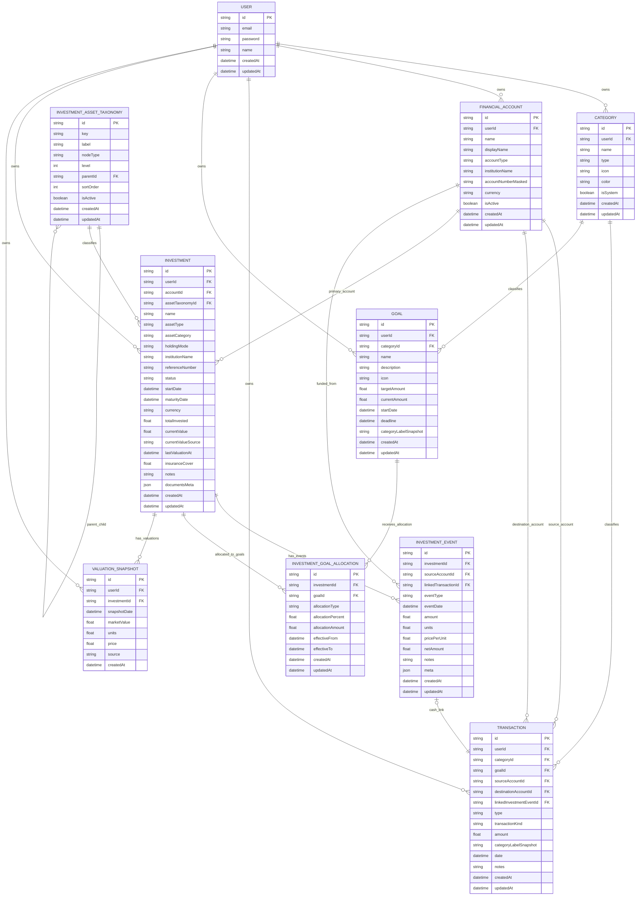

# Investment ER Diagram

This document captures the agreed investment ER schema plus the new `INVESTMENT_ASSET_TAXONOMY` extension for future DB-backed taxonomy management.

## Extended Investment ERD

## Extension Notes

- This is an extension to the agreed schema, not a replacement.
- `Investment.assetType` and `Investment.assetCategory` remain in place for compatibility.
- `Investment.assetTaxonomyId` is the new optional hook into a future taxonomy tree.
- `InvestmentAssetTaxonomy.parentId` stores the parent-child relationship.
- The intended hierarchy can grow gradually up to 5 levels.