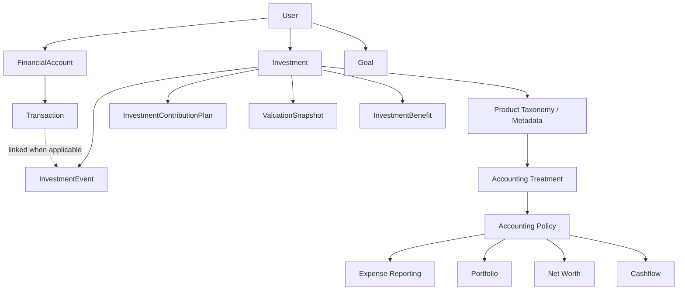
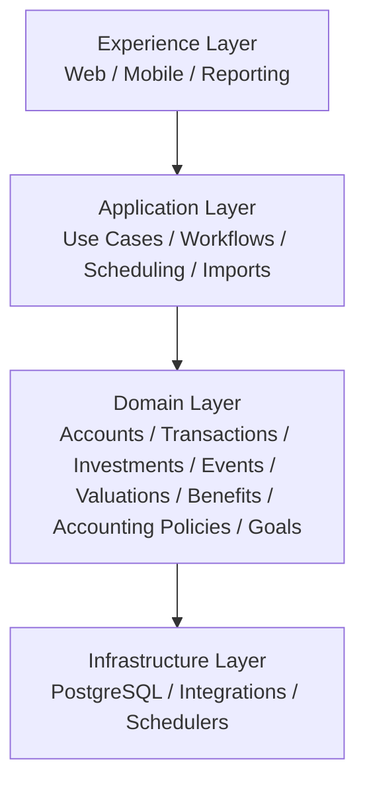

# Product Architecture

> **Status:** Canonical architecture source of truth  
> **Audience:** Engineering, Product, QA, Data, Operations, Security, and future maintainers  
> **Scope:** Entire finance application  
> **Purpose:** Describe the architecture that is true today. Major changes should be accompanied by an ADR.

## 1. Why this document exists

This directory defines the long-lived architecture of the finance product.

It explains:

- the major domain concepts and their responsibilities;
- how money movement differs from product activity and valuation;
- what data is authoritative;
- how products are classified and how accounting behavior is determined;
- the architectural invariants future features must preserve;
- security, data-integrity, scalability, and operational expectations;
- how significant architectural decisions are recorded and evolved.

This documentation intentionally avoids becoming API documentation, UI documentation, or a migration log.

## 2. Architecture map

## 3. Core architectural principles

### 3.1 Product identity and financial behavior are separate

Product taxonomy answers:

> What kind of product is this?

Accounting treatment answers:

> How should this product behave financially?

Business logic must not depend on product display names.

### 3.2 Cash movement, product activity, and valuation are separate

- `Transaction` = actual cash/account movement.
- `InvestmentEvent` = financial activity associated with a financial product.
- `ValuationSnapshot` = observed value at a point in time.
- `InvestmentBenefit` = contractual or expected future entitlement.

One real-world action may create more than one of these records.

### 3.3 Scheduled activity is not actual financial activity

A recurring plan creates expected activity. Only realized/confirmed activity affects actual financial totals.

### 3.4 Historical meaning must be preserved

Changes to configuration must not silently reinterpret historical financial activity.

### 3.5 Generic concepts are preferred over product-specific subsystems

New financial products should normally fit into existing aggregates, taxonomy, accounting treatments, event types, scheduling, and valuation concepts.

A new product name alone is not justification for a new table or subsystem.

## 4. Canonical documents

- [Domain Model](./domain-model.md)
- [Data and Accounting](./data-and-accounting.md)
- [Security and Data Integrity](./security-and-integrity.md)
- [Scalability and Operations](./scalability-and-operations.md)
- [Architecture Diagrams](./diagrams/README.md)
- [Architecture Decision Records](./adr/README.md)

## 5. Source-of-truth map

| Question | Canonical concept |
|---|---|
| Who owns the financial data? | `User` |
| Where is money held? | `FinancialAccount` |
| Did cash move? | `Transaction` |
| What happened to a financial product? | `InvestmentEvent` |
| What is planned to happen repeatedly? | `InvestmentContributionPlan` |
| What was the product worth at a point in time? | `ValuationSnapshot` |
| What future contractual benefit exists? | `InvestmentBenefit` |
| What type of product is this? | Product taxonomy / metadata |
| How should it behave financially? | Accounting treatment |
| What is the product's current lifecycle state? | `Investment` |

## 6. Layered architecture

Business rules belong in the domain/application layers, not independently in UI components, report SQL, schedulers, or integration adapters.

## 7. Architectural invariants

The following are product-wide invariants:

1. A record existing in `Investment` does not imply that all money paid toward it is invested capital.
2. Product names and user-facing categories do not define accounting behavior.
3. A valuation is not a transaction and does not automatically create an investment event.
4. Expected or pending events do not affect realized financial totals.
5. Product lifecycle and contribution/premium-plan lifecycle are independent.
6. Reports consume accounting semantics; reports do not define accounting semantics.
7. Historical financial meaning must remain explainable after configuration changes.
8. User ownership must be enforced server-side for all user-scoped data.
9. Financial operations that may retry must be idempotent where practical.
10. Derived values may be cached, but authoritative facts must remain reproducible.

## 8. How architecture changes

When a change affects a domain boundary, source of truth, accounting semantic, lifecycle rule, or cross-cutting system behavior:

1. Create or update an ADR.
2. Record alternatives and trade-offs.
3. Define migration and backward-compatibility implications.
4. Update this canonical architecture.
5. Update implementation and tests.

Routine feature changes should not require rewriting the architecture documentation.

## 9. Non-goals

This architecture does not define the product as:

- a full double-entry accounting platform;
- an insurer policy-administration platform;
- a brokerage order-management system;
- a tax engine;
- an actuarial valuation platform.

If those capabilities become product requirements, they require explicit architectural review.
