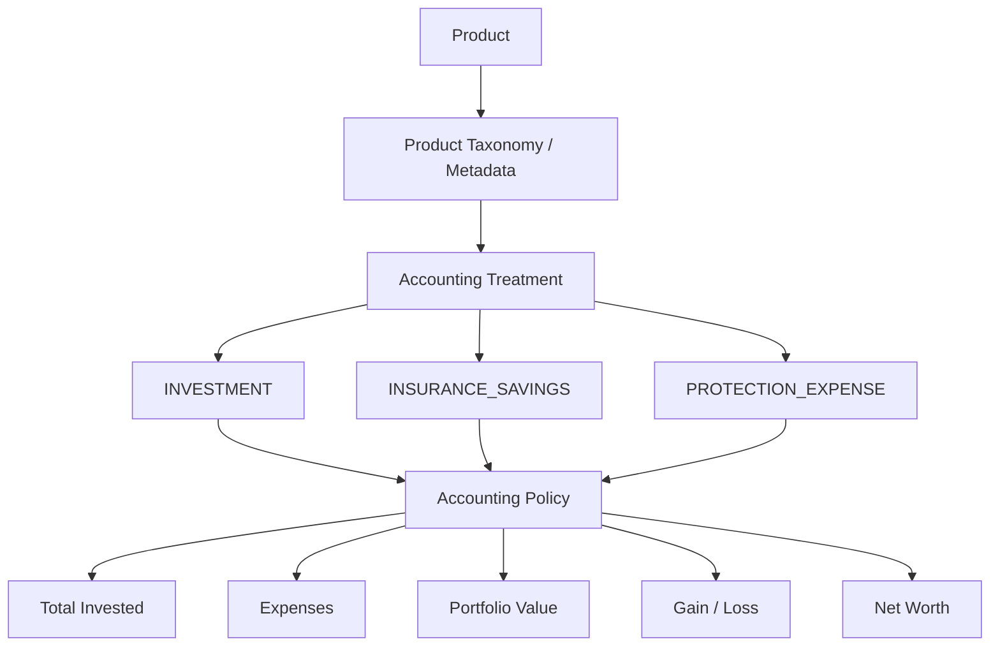
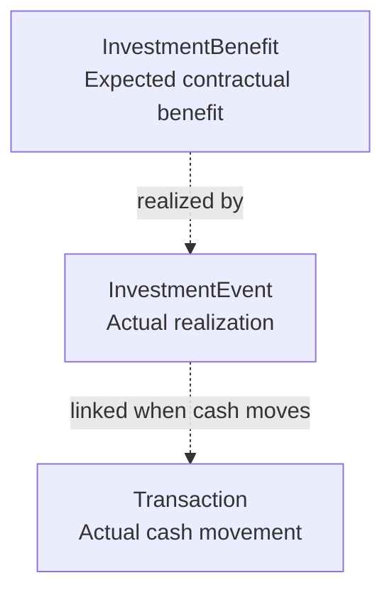

# Data and Accounting Semantics

> **Purpose:** Define the canonical financial meaning of transactions, events, valuations, totals, accounting treatments, historical openings, and insurance behavior.

## 1. Core principle

The architecture separates:

```text
What is the product?
        ↓
Product taxonomy

What happened?
        ↓
Transaction / InvestmentEvent / ValuationSnapshot

How should it count?
        ↓
AccountingTreatment
```

## 2. Accounting treatment

Accounting treatment determines how product activity contributes to:

- total invested;
- expenses;
- portfolio value;
- gain/loss;
- asset allocation;
- net worth;
- cashflow reporting.

Initial treatments:

```text
INVESTMENT
INSURANCE_SAVINGS
PROTECTION_EXPENSE
```

## 3. Product type vs accounting treatment

These are different dimensions.

| Product | Product family | Accounting treatment |
|---|---|---|
| Mutual Fund | Investment | `INVESTMENT` |
| PPF | Investment | `INVESTMENT` |
| ULIP | Insurance | `INSURANCE_SAVINGS` |
| Money Back | Insurance | `INSURANCE_SAVINGS` |
| Health Insurance | Insurance | `PROTECTION_EXPENSE` |
| Term Insurance | Insurance | `PROTECTION_EXPENSE` |

Business logic must not infer accounting behavior from product names.

## 4. Accounting-treatment architecture



Accounting rules should be centralized. Controllers, UI code, schedulers, imports, and reports must not independently reproduce them.

## 5. Event types

Canonical investment-event types:

- `CONTRIBUTION`
- `PREMIUM`
- `OPENING_BALANCE`
- `OPENING_INCOME_CREDIT`
- `INCOME_CREDIT`
- `WITHDRAWAL_PRINCIPAL`

`PREMIUM` is required because premiums are a distinct business fact even when their accounting effect differs by product.

Examples:

```text
PPF contribution        -> CONTRIBUTION
PPF annual interest     -> INCOME_CREDIT
LIC premium             -> PREMIUM
Health premium          -> PREMIUM
```

## 6. Event status and realized accounting

Event statuses include:

- `EXPECTED`
- `PENDING`
- `CONFIRMED`
- `SKIPPED`
- `FAILED`
- `CANCELLED`

Canonical rule:

| Status | Actual accounting impact |
|---|---|
| `EXPECTED` | No |
| `PENDING` | No |
| `CONFIRMED` | Yes |
| `SKIPPED` | No |
| `FAILED` | No |
| `CANCELLED` | No |

Expected and pending events may be used for forecasting and reminders.

## 7. `totalInvested`

Canonical definition:

> `totalInvested` is the principal or qualifying long-term contribution currently attributed to the product for portfolio-accounting purposes.

It is **not** the total amount ever paid toward the product.

### Behavior

| Accounting treatment | Event | `totalInvested` |
|---|---|---|
| `INVESTMENT` | `CONTRIBUTION` | Increase |
| `INVESTMENT` | `INCOME_CREDIT` | No change |
| `INVESTMENT` | `WITHDRAWAL_PRINCIPAL` | Decrease |
| `INSURANCE_SAVINGS` | `PREMIUM` | Increase |
| `PROTECTION_EXPENSE` | `PREMIUM` | No change |

Protection premiums must never be stored as invested principal merely because the product exists in `Investment`.

## 8. `currentValue`

`currentValue` is meaningful only when the product has a useful current valuation.

Examples where valuation is meaningful:

- mutual funds;
- stocks;
- ULIP fund value;
- products with an explicit surrender/fund value.

Examples where valuation may not be meaningful:

- health insurance;
- normal term insurance;
- some traditional money-back or endowment policies.

Architectural distinction:

```text
NULL / not available
    !=
known value = 0
```

Where practical, the data model should preserve this distinction.

## 9. Valuation rules

`ValuationSnapshot` is authoritative for observed values over time.

Canonical rules:

```text
CONTRIBUTION
    -> may increase operational current value
    -> increases totalInvested

INCOME_CREDIT
    -> may increase current value
    -> totalInvested unchanged

WITHDRAWAL_PRINCIPAL
    -> may reduce current value
    -> reduces totalInvested

ValuationSnapshot
    -> sets/observes current value
    -> totalInvested unchanged
```

A valuation snapshot does not automatically create an event.

## 10. Gain/loss

Gain/loss must not be universally calculated as:

```text
currentValue - totalInvested
```

That formula is valid only when:

- invested principal has meaningful economic interpretation; and
- current valuation has meaningful economic interpretation.

Accounting policy should determine whether gain/loss is supported.

Examples:

| Product | Generic gain/loss |
|---|---|
| Mutual Fund | Supported |
| Stock | Supported |
| Traditional Money Back | Usually not generic |
| Health Insurance | Not supported |
| Term Insurance | Not supported |

## 11. Protection insurance

Examples:

- health insurance;
- normal term insurance;
- car insurance;
- bike insurance;
- travel insurance;
- personal accident insurance.

Treatment:

```text
PROTECTION_EXPENSE
```

A confirmed premium:

- contributes to expense reporting;
- contributes to cashflow;
- participates in premium reminders/coverage reporting;
- does **not** increase total invested;
- does **not** increase portfolio value;
- does **not** participate in investment allocation;
- does **not** generate gain/loss.

## 12. Insurance savings

Examples:

- ULIP;
- money-back policy;
- endowment;
- return-of-premium term product.

Treatment:

```text
INSURANCE_SAVINGS
```

A confirmed premium:

- counts as qualifying long-term financial contribution;
- may increase `totalInvested`;
- does not automatically imply a current value;
- does not automatically imply generic gain/loss.

## 13. Policy term vs premium-pay term

These are separate.

Operational representation:

```text
Investment.startDate
Investment.maturityDate

InvestmentContributionPlan.anchorDate
InvestmentContributionPlan.endDate
```

If the contract must preserve terms exactly as issued, optional term fields may also be stored, such as:

```text
policyTermValue
policyTermUnit

premiumPayTermValue
premiumPayTermUnit
```

Dates remain authoritative for scheduling.

## 14. Historical opening values

Historical onboarding must establish starting state without creating current-period activity.

Use:

- `OPENING_BALANCE`
- `OPENING_INCOME_CREDIT`

Example:

```text
Existing PPF principal:           500,000
Historical accumulated interest: 150,000
```

Represent as:

```text
OPENING_BALANCE        500,000
OPENING_INCOME_CREDIT  150,000
```

These should not create fake current-period transactions.

## 15. Benefits

`InvestmentBenefit` represents contractual/expected future payments.

Examples:

- money back;
- maturity;
- survival;
- bonus;
- return of premium;
- death benefit.

Expected benefit and realized payment are different:



## 16. Principal return and mixed benefits

A benefit received while a product remains active must preserve its economic nature.

A payment may represent:

- principal return;
- income/bonus;
- a mixture.

Do not blindly map every money-back receipt to `INCOME_CREDIT`.

Where a payment contains multiple economic components, preserve component allocation through explicit events or metadata sufficient for deterministic accounting.

## 17. Financial precision

Authoritative monetary values should use fixed decimal arithmetic.

Preferred default:

```text
Decimal(18,2)
```

unless a domain such as unit pricing requires greater scale.

Floating-point values should not be the long-term authoritative representation for money.
