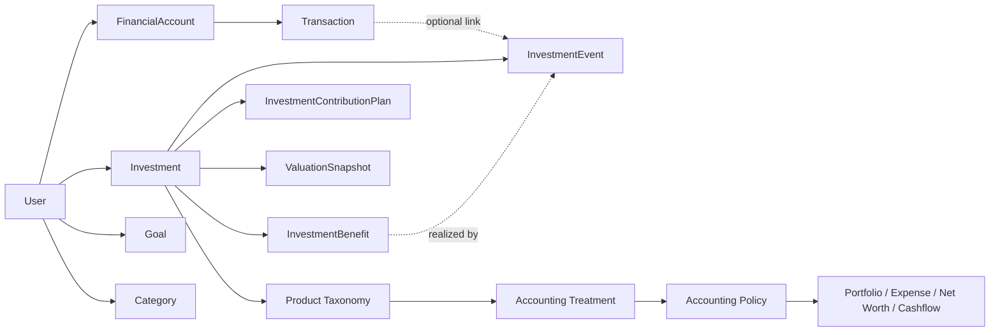

# Domain Overview



## Responsibility summary

```text
FinancialAccount          = where money is held
Transaction               = cash movement
Investment                = financial-product ownership/lifecycle
InvestmentEvent           = product financial activity
ContributionPlan          = expected recurring activity
ValuationSnapshot         = observed value
InvestmentBenefit         = contractual future entitlement
Product Taxonomy          = what the product is
AccountingTreatment       = how the product behaves financially
Goal                      = financial objective
```
