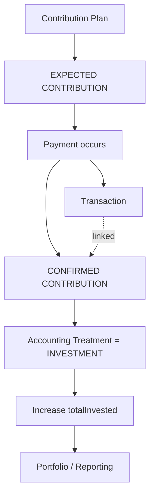
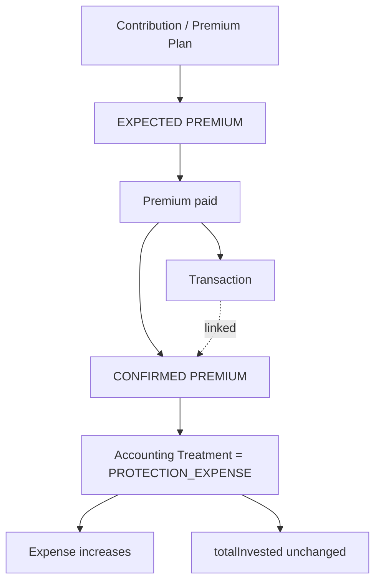
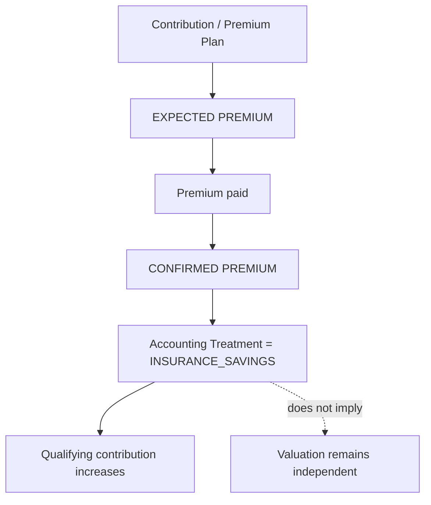
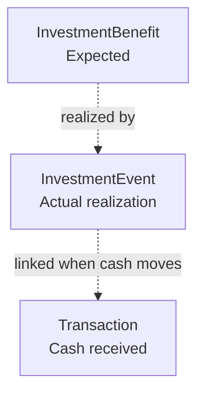

# Financial Flow

## Investment contribution

```mermaid
flowchart TD
    CP[Contribution Plan]
    EE[EXPECTED CONTRIBUTION]
    PAY[Payment occurs]
    T[Transaction]
    CE[CONFIRMED CONTRIBUTION]
    AT[Accounting Treatment = INVESTMENT]
    TI[Increase totalInvested]
    R[Portfolio / Reporting]

    CP --> EE --> PAY
    PAY --> T
    PAY --> CE
    T -. linked .-> CE
    CE --> AT --> TI --> R
```

## Protection insurance premium

```mermaid
flowchart TD
    CP[Contribution / Premium Plan]
    EE[EXPECTED PREMIUM]
    PAY[Premium paid]
    T[Transaction]
    CE[CONFIRMED PREMIUM]
    AT[Accounting Treatment = PROTECTION_EXPENSE]
    EX[Expense increases]
    TI[totalInvested unchanged]

    CP --> EE --> PAY
    PAY --> T
    PAY --> CE
    T -. linked .-> CE
    CE --> AT
    AT --> EX
    AT --> TI
```

## Insurance-savings premium

```mermaid
flowchart TD
    CP[Contribution / Premium Plan]
    EE[EXPECTED PREMIUM]
    PAY[Premium paid]
    CE[CONFIRMED PREMIUM]
    AT[Accounting Treatment = INSURANCE_SAVINGS]
    TI[Qualifying contribution increases]
    VAL[Valuation remains independent]

    CP --> EE --> PAY --> CE --> AT --> TI
    AT -. does not imply .-> VAL
```

## Contractual benefit

```mermaid
flowchart TD
    B[InvestmentBenefit<br/>Expected]
    E[InvestmentEvent<br/>Actual realization]
    T[Transaction<br/>Cash received]

    B -. realized by .-> E
    E -. linked when cash moves .-> T
```
