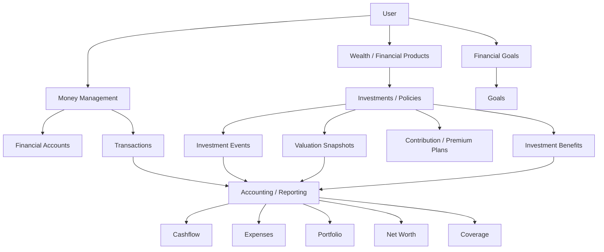

# System Context

```mermaid
flowchart TD
    U[User]

    U --> MM[Money Management]
    U --> WP[Wealth / Financial Products]
    U --> FG[Financial Goals]

    MM --> FA[Financial Accounts]
    MM --> T[Transactions]

    WP --> I[Investments / Policies]
    I --> E[Investment Events]
    I --> V[Valuation Snapshots]
    I --> P[Contribution / Premium Plans]
    I --> B[Investment Benefits]

    FG --> G[Goals]

    T --> ACCT[Accounting / Reporting]
    E --> ACCT
    V --> ACCT
    B --> ACCT

    ACCT --> CF[Cashflow]
    ACCT --> EX[Expenses]
    ACCT --> PF[Portfolio]
    ACCT --> NW[Net Worth]
    ACCT --> CV[Coverage]
```
