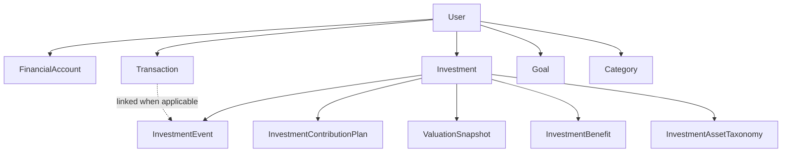
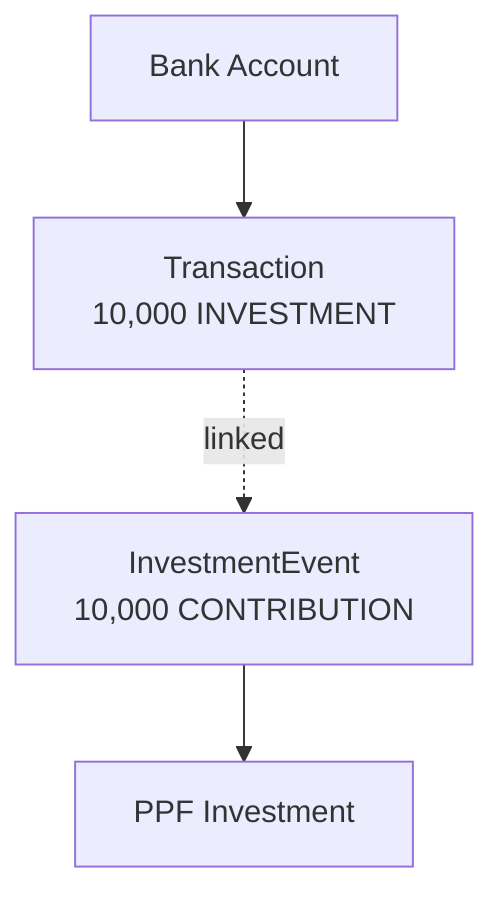

# Domain Model

> **Purpose:** Define the meaning, responsibility, boundaries, and relationships of the core domain concepts.

## 1. Domain overview



## 2. User

`User` is the ownership boundary for financial data.

A user owns or scopes:

- financial accounts;
- transactions;
- investments;
- goals;
- categories;
- investment taxonomy;
- valuation snapshots.

All access to user-scoped financial records must be authorized against this boundary.

## 3. FinancialAccount

`FinancialAccount` represents a place where money is held or moved.

Examples:

- bank account;
- cash account;
- wallet;
- broker-linked cash account.

It answers:

> Where is the money?

It is not responsible for calculating investment performance.

The current model includes account type, institution, masked account reference, currency, active state, opening balance, and source/destination transaction relationships.

## 4. Transaction

`Transaction` represents actual cash movement or financial classification.

Current transaction types include:

- `INCOME`
- `EXPENSE`
- `TRANSFER`
- `INVESTMENT`

A transaction may reference:

- source account;
- destination account;
- category;
- goal;
- amount;
- date;
- notes.

It answers:

> What happened to the user's cash?

Examples:

- salary received;
- rent paid;
- money transferred;
- mutual-fund contribution funded;
- insurance premium paid.

## 5. Investment

`Investment` is the common long-term financial-product aggregate.

It may represent:

- mutual funds;
- stocks;
- fixed deposits;
- recurring deposits;
- PPF;
- NPS;
- EPFO;
- ULIP;
- endowment;
- money-back policies;
- protection insurance products that require policy/premium/coverage tracking.

It owns or references:

- product taxonomy;
- asset type/category metadata;
- product lifecycle;
- contribution plans;
- investment events;
- valuation snapshots;
- insurance cover;
- future investment benefits.

The existence of a record in `Investment` does **not** imply that all payments toward it count as invested capital.

## 6. Product taxonomy and metadata

`InvestmentAssetTaxonomy` and application metadata classify products.

They answer:

> What kind of product is this?

Taxonomy is used for:

- classification;
- navigation;
- display;
- defaults;
- reporting dimensions;
- product configuration.

Taxonomy must not be the sole mechanism for determining accounting behavior.

## 7. InvestmentEvent

`InvestmentEvent` records financial activity associated with an `Investment`.

Event responsibilities include:

- what happened;
- when it happened;
- expected/pending/confirmed status;
- event source;
- amount;
- recurring-plan linkage;
- transaction linkage;
- supporting metadata.

Recommended event vocabulary:

- `CONTRIBUTION`
- `PREMIUM`
- `OPENING_BALANCE`
- `OPENING_INCOME_CREDIT`
- `INCOME_CREDIT`
- `WITHDRAWAL_PRINCIPAL`

An event describes the fact. Accounting treatment determines the financial effect.

## 8. InvestmentContributionPlan

`InvestmentContributionPlan` represents expected recurring or one-time funding activity associated with a financial product.

It is reused for:

- SIPs;
- PPF contributions;
- RD deposits;
- insurance premiums.

It owns:

- amount;
- cadence;
- anchor date;
- next due date;
- end date;
- reminder settings;
- status;
- event-generation behavior.

The plan represents **expected activity**, not realized financial history.

## 9. ValuationSnapshot

`ValuationSnapshot` records observed value at a point in time.

It may contain:

- market value;
- units;
- price;
- source;
- snapshot date.

It answers:

> What was this product worth at this point in time?

It must remain independent from investment events.

A snapshot does not automatically create a contribution, income event, or transaction.

## 10. InvestmentBenefit

`InvestmentBenefit` represents contractual or expected future entitlement.

Examples:

- `MONEY_BACK`
- `MATURITY`
- `SURVIVAL`
- `BONUS`
- `RETURN_OF_PREMIUM`
- `DEATH_BENEFIT`
- `OTHER`

Suggested fields:

- `investmentId`
- `benefitType`
- `amount`
- `benefitDate`
- `status`
- `notes`
- `meta`

A benefit is not financial history until realized.

When realized, it should be linked to the corresponding financial event and, where money moves, a transaction.

## 11. Goal

`Goal` represents a financial objective.

Examples:

- emergency fund;
- home purchase;
- education;
- retirement target.

Architectural distinction:

```text
Investment = financial product
Goal       = desired financial outcome
```

Goals should not become substitutes for investment or account aggregates.

## 12. Category

`Category` provides user-facing classification for financial activity.

Examples:

- salary;
- food;
- transport;
- insurance;
- housing.

Categories are primarily a transaction/reporting concern.

A category such as `Insurance` cannot determine whether a premium is a long-term contribution or an expense.

## 13. Transaction vs InvestmentEvent

These concepts represent different perspectives.

```text
Transaction
    = cash/account movement

InvestmentEvent
    = product activity
```

Example:



A single real-world action may create both records.

## 14. Product lifecycle vs payment lifecycle

Product lifecycle and payment-plan lifecycle are independent.

Recommended product states:

- `ACTIVE`
- `MATURED`
- `EXITED`
- `CANCELLED`

Recommended contribution-plan states:

- `ACTIVE`
- `COMPLETED`
- `PAUSED`
- `CANCELLED`

Example:

```text
Policy starts:         2016
Premium payments end:  2032
Policy matures:        2041
```

From 2032 to 2041:

```text
Investment.status = ACTIVE
ContributionPlan.status = COMPLETED
```
