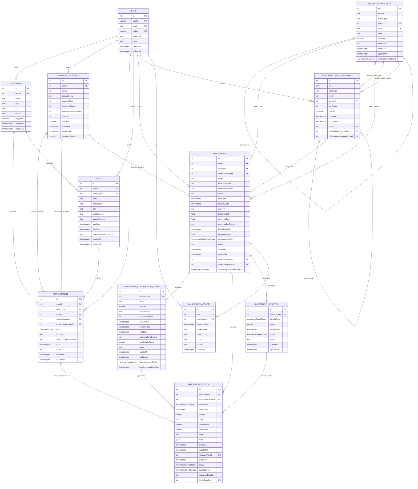

# Database ER Diagram

This document is generated from the canonical PostgreSQL schema in [server/prisma/sql/dump-my_react_app-202609201913.sql](../../server/prisma/sql/dump-my_react_app-202609201913.sql). The Prisma models in [server/prisma/schema.prisma](../../server/prisma/schema.prisma) provide application-side naming context.

## Complete ERD

## Schema Notes

- `o|` marks an optional child-side foreign key. Nullable foreign keys are `SET NULL` on deletion unless noted otherwise.
- User-owned records are deleted with their user through `ON DELETE CASCADE`.
- Category references on `transactions` and `goals`, and asset metadata references on `investments`, use `ON DELETE RESTRICT`.
- `investment_events.linkedTransactionId` is nullable and unique, so a transaction can link to at most one investment event. The foreign key uses `ON DELETE SET NULL`.
- `investment_events` can optionally link to a contribution plan and benefit. The recurring-event unique index prevents duplicate `(recurringPlanId, dueDate, eventType)` combinations.
- `app_meta_config_ref` and `investment_asset_taxonomy` are self-referencing trees. Their nullable parent references use `ON DELETE SET NULL`.
- The `investments` trigger `validate_investment_meta_config_pair` requires active investment asset-type and asset-category config rows whose parent relationship matches.
- The `investment_asset_taxonomy` trigger `validate_investment_taxonomy_defaults_meta` validates optional default metadata and requires a type when a category default is set.
- PostgreSQL enum values are defined in the SQL dump for `AccountingTreatment`, `HistoricalImportMode`, `InvestmentBenefitStatus`, `InvestmentBenefitType`, `InvestmentContributionMode`, `InvestmentEventSource`, `InvestmentEventStatus`, `InvestmentEventType`, and `TransactionType`.