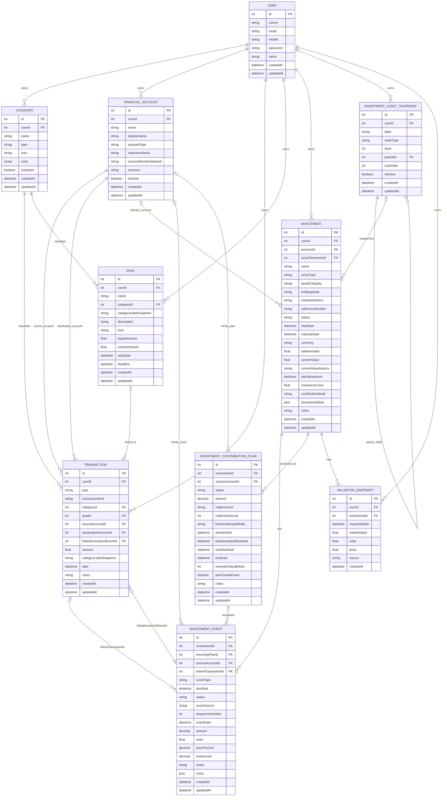

# Investment ER Diagram

This document is synced to the canonical SQL schema in server/prisma/sql/core_schema.sql.

## Core ERD

## Sync Notes

- This ERD reflects the current table and foreign-key structure in [server/prisma/sql/core_schema.sql](/Users/asitpanda/asitprojects/mine/my-financial/server/prisma/sql/core_schema.sql).
- Child-side optionality in the relationships above follows nullable foreign keys in the SQL schema.
- The transaction and investment-event cross-link is shown as two nullable references because `core_schema.sql` defines both foreign keys independently and does not add a uniqueness constraint.
- Recurring scheduler uniqueness is enforced at DB level on `(recurringPlanId, dueDate, eventType)`.
