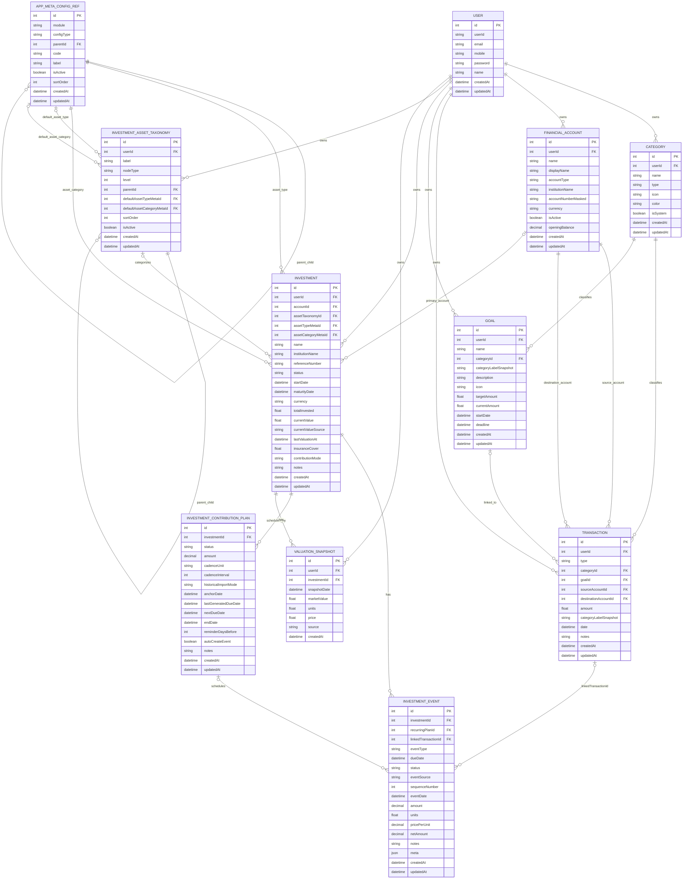

# Investment ER Diagram

This document is synced to the canonical SQL schema in server/prisma/sql/core_schema.sql.

## Core ERD

## Sync Notes

- This ERD reflects the current table and foreign-key structure in [server/prisma/sql/core_schema.sql](/Users/asitpanda/asitprojects/mine/my-financial/server/prisma/sql/core_schema.sql) and [server/prisma/schema.prisma](/Users/asitpanda/asitprojects/mine/my-financial/server/prisma/schema.prisma).
- Child-side optionality in the relationships above follows nullable foreign keys in the SQL schema.
- `investment.assetType`/`assetCategory` free-text fields have been replaced by `assetTypeMetaId`/`assetCategoryMetaId`, both required FKs into the shared `app_meta_config_ref` table (self-referencing tree of `ASSET_TYPE`/`ASSET_CATEGORY` rows scoped by `module`/`configType`).
- `investment_asset_taxonomy` nodes can optionally carry `defaultAssetTypeMetaId`/`defaultAssetCategoryMetaId` hints into `app_meta_config_ref`; taxonomy remains an organizational bucket, not the source of truth for asset classification.
- `linkedTransactionId` on `investment_event` is a single, unique, nullable FK back to `transaction`; there is no reverse FK on the transaction side.
- `financial_accounts` do not directly fund `investment_event`/`investment_contribution_plan` rows; account linkage for investments is only via `investment.accountId` (primary account).
- `investments.status` also carries a DB-level `CHECK` constraint restricting values to `active`, `matured`, `closed` (not expressed by Prisma's type system).
- Recurring scheduler uniqueness is enforced at DB level on `(recurringPlanId, dueDate, eventType)`.
